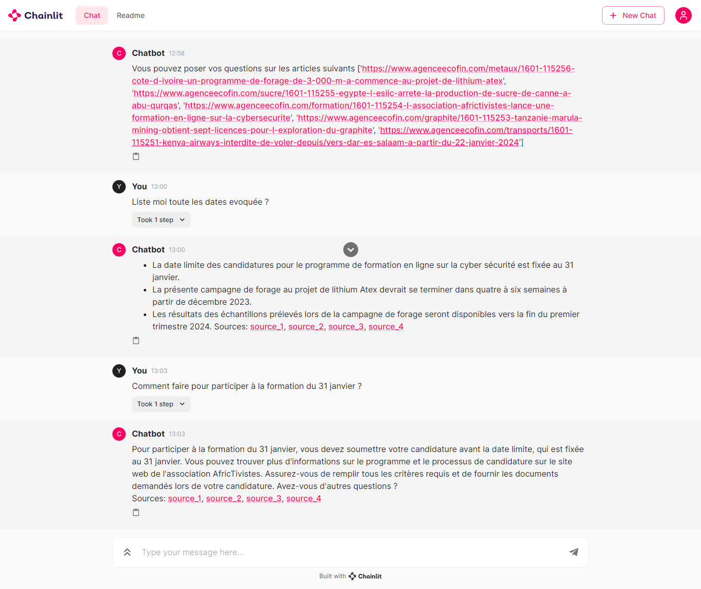
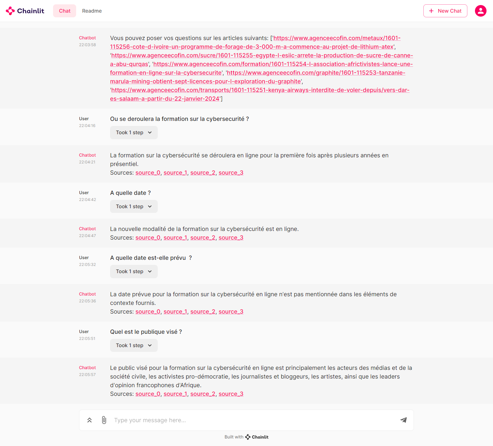

# Création D'un Agent Conversationnel Spécialisé

Ce repo présente la construction d'un agent conversationnel capable de répondre aux questions sur une base de documents spécifique en utilisant la technique de la génération augmenté de récupération (Retrieval Augmented Generation -[RAG](https://www.elastic.co/fr/what-is/retrieval-augmented-generation) en anglais).
L'agent a été conçu en deux versions :
- Une première version classique répondant aux questions sans tenir compte des réponses précédentes.
- Une seconde version plus avancé qui répond au question en prénant en compte les réponses précédentes.

## Etapes de Réalisations

1. **Préparation des données:** Nous avons tout d'abord scraper, traiter et stocker quelques articles du site [Ecofin](https://www.agenceecofin.com/a-la-une/recherche-article?filterTitle=&submit.x=0&submit.y=0&filterTousLesFils=Tous&filterCategories=Sous-rubrique&filterDateFrom=&filterDateTo=&option=com_dmk2articlesfilter&view=articles&filterFrench=French&Itemid=269&userSearch=1&layout=#dmk2articlesfilter_results) 📚 afin de construire notre base de documents.
Voir fichier `scrape_data.py`.

2.  **Creation d'une chaine de traitement:** Ensuite nous avons créer une chaine de traitement `Conversational Retrieval Chain` pour le RAG.

3. **Interface web:** Finalement le tout a été incorporer dans une interface web conviviale en utilisant `Chainlit` pour interagir avec l'agent.💬

## Fonctionnement global de l'agent

- Recuperation des articles sous forme de documents
- Découper ces documents en morceaux et créer des embeddings.
- Stocker ces embeddings sur Chroma
- Creer une chaine de traitement avec un model llm et les vecteurs embeddings.
- Répondre aux questions des utilisateurs et montrer les sources utilisées pour répondre.

### Résultats
- Agent version sans mémoire


- Agent version 2 avec mémoire


## Comment faire fonctionner le code ?

1. Installer les dépendances Python :
```shell
pip install -r requirements.txt
```

2. Renomer le fichier  `.env.example` en `.env` et inserer votre clé d'api openai:
```.env
OPENAI_API_KEY=VOTRE_OPENAI_API_KEY
```
3. Executer le script pour scraper et stoker les données:
```shell
python scrape_data.py
```
4. Lancez la démo et commencer à interagir avec l'agent. Cela ouvrira une fenêtre de navigateur avec l'interface Chainlit.

- Version de l'Agent sans memoire: ne prends pas en compte les reponses précédentes
```shell
chainlit run agent_app.py 
```
- Version de l'Agent avec memoire: prend en compte les réponses précédentes
```shell
chainlit run agent_app_v2.py 
```

## Réferences
- [Cookbook/chroma-qa-chat](https://github.com/Chainlit/cookbook/tree/main/chroma-qa-chat) de `chainlit`.
- [Cookbook/pdf-qa](https://github.com/Chainlit/cookbook/tree/main/pdf-qa)  de `chainlit`
- [Documentation Langchain RAG ](https://python.langchain.com/docs/expression_language/cookbook/retrieval#conversational-retrieval-chain)
